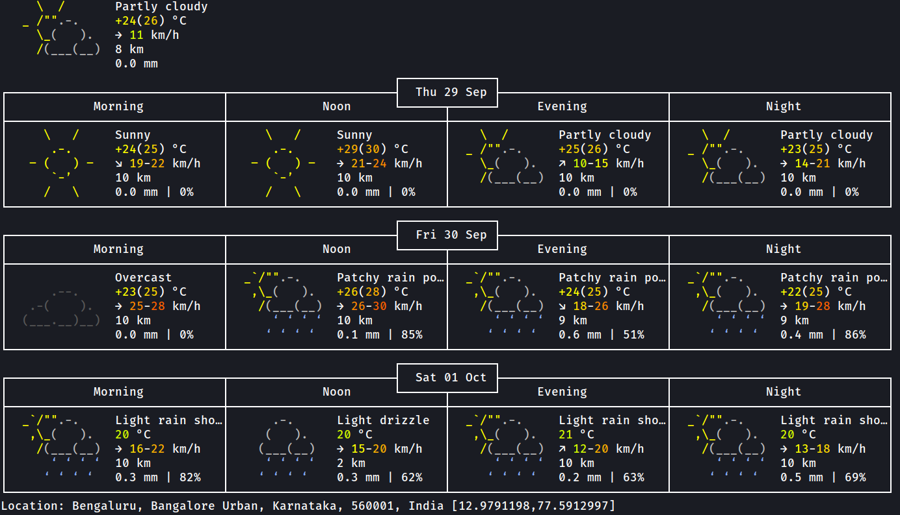

<div align="center">
 <a href="#">
    
</a>
  
<h2 align="center">WEATHER PREDICTION</h2>
  
<p align="center">
    <a
      href="https://github.com/Shirshakhtml/weather-predictor/issues/new?assignees=&labels=bug">Report
      Bug</a>
    ·
    <a href="https://github.com/Shirshakhtml/weather-predictor/issues">Request Feature</a>
  </p>


  
<h3 align="center">Quick weather checking script</h3>

  ## Usage 
```bash
bash weather.sh --help
``` 
